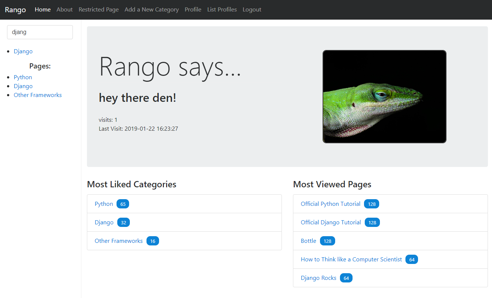

# Tango with Django Project
Tango with Django - Rango Application - UoG 2018/19 WAD2

Example website available [here](http://2086380a.pythonanywhere.com/rango/) for next 3 months, hosted on PythonAnywhere.



This repository is used for the development of the Rango application shown in the How to Tango with Django 1.9 Book.

## Setup the project

```bash
# Setup virtual environment
$ pip install virtualenv
$ virtualenv venv

# Enter virtual environment
$ (UNUX) source ./venv/bin/activate
$ (WIN)  .\venv\Scripts\activate

# Install requirements & run server

$ pip install -r requirements.txt
$ python manage.py makemigrations
$ python manage.py migrate
$ python manage.py runserver
```


## Rango Application Tests

Tests taken from [gerac83's rango tests](https://github.com/gerac83/rango_tests)

- [x] Chapter 3 - 2/2 passed
- [x] Chapter 4 - 7/7 passed
- [x] Chapter 5   - 3/3 passed
- [x] Chapter 6   - 11/11 passed
- [x] Chapter 7   - 6/6 passed
- [x] Chapter 8   - 7/7 passed
- [x] Chapter 9   - 6/6 passed
- [x] Chapter 10 - 4/4 passed
- [x] Live Server Tests - 22/22 passed

**Total:** 68 passed test cases